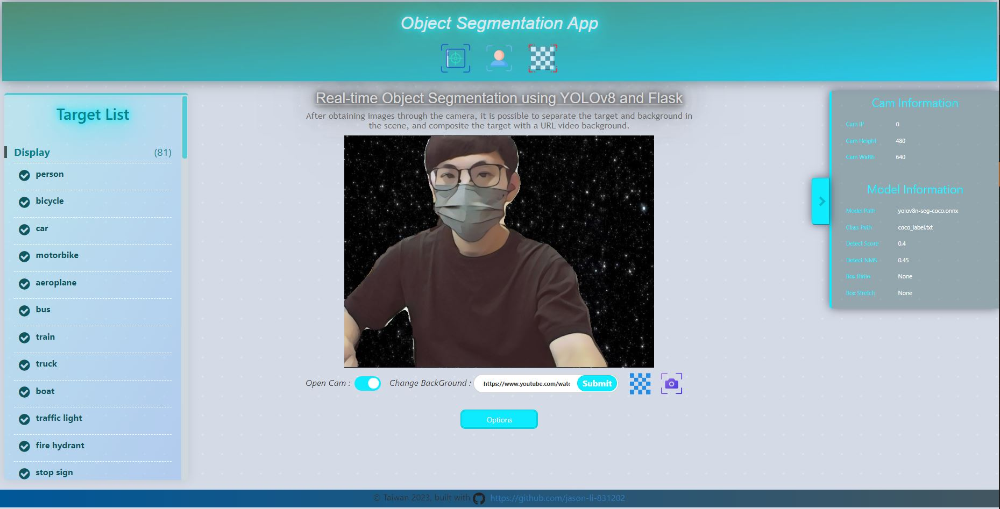
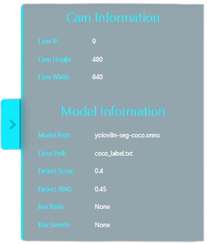
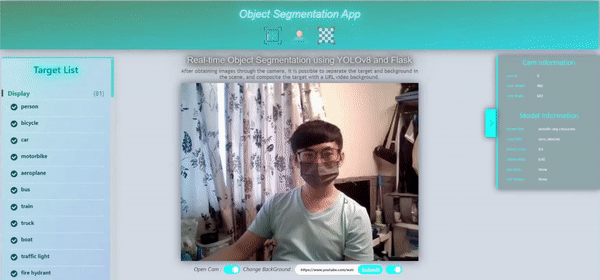
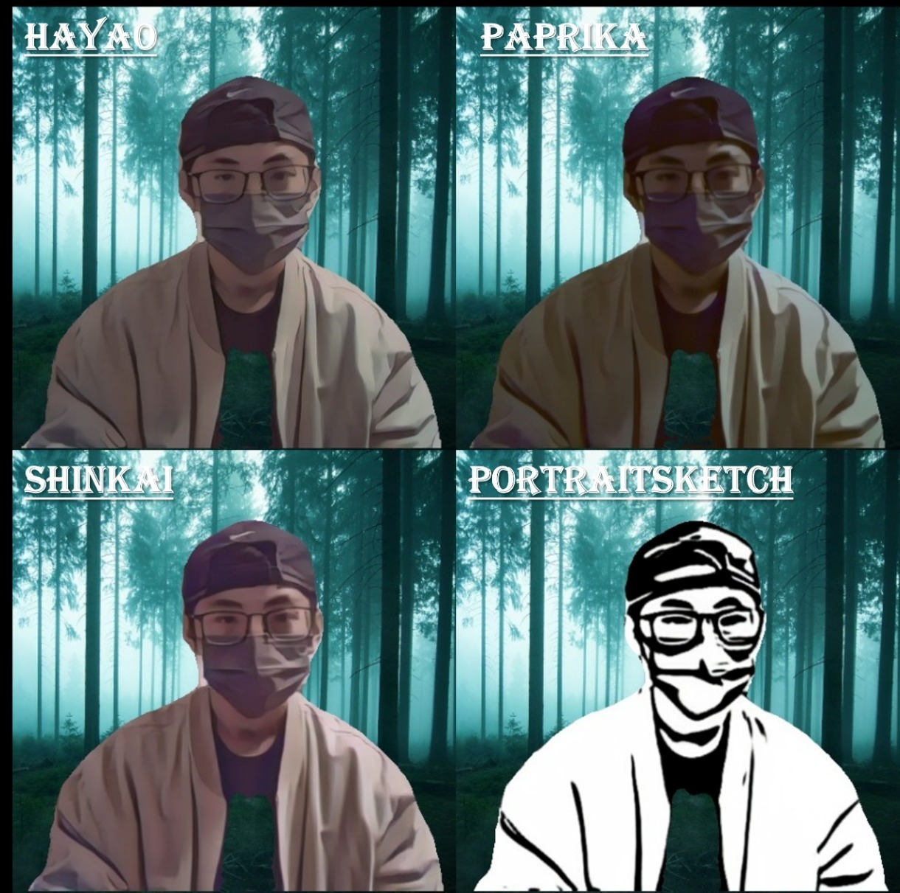

<p align="center">
  
</p>

<h1 align="center"> Object Segmentation Web using YoloV8 with Flask </h1>

Web application for real-time object segmentation using Flask , [YOLOv8](https://github.com/ultralytics/ultralytics), [AnimeGANv2/v3](https://github.com/TachibanaYoshino/AnimeGANv2) model in ONNX weights.


After obtaining images through the camera, it is possible to separate the target and background in the scene, and composite the target with a Web URL/Local Path video background. Additionally, you can change different display styles.


# ➤ Contents
1) [Requirements](#Requirements)

2) [ONNX-Model](#ONNX-Model)

3) [Examples](#Examples)

4) [Demo](#Demo)

<p align="center">
    
</p>

<h1 id="Requirements">➤ Requirements</h1>

* **OpenCV**, **Flask**, **gevent**, **onnxruntime** and **youtube-dl**. 
* **Install :**

    The `requirements.txt` file should list all Python libraries that your notebooks
    depend on, and they will be installed using:

    ```
    pip install -r requirements.txt
    ```
* **Note :**

    If you use a YouTube URL as the link to replace your background, please make sure to modify the following.

    1) YouTube Unable to extract uploader id, so you need to revise [`Your Path`]\site-packages\youtube_dl\extractor\youtube.py : 
    
    - > `'uploader_id': self._search_regex(r'/(?:channel|user)/([^/?&#]+)', owner_profile_url, 'uploader id') if owner_profile_url else None,` 

      $\Downarrow$ 
    - > `'uploader_id': self._search_regex(r'/(?:channel/|user/|@)([^/?&#]+)', owner_profile_url, 'uploader id', default=None),`

    2) Youtube does no longer have a like/dislike count, so you need to comment out [`Your Path`]\site-packages\pafy\backend_youtube_dl.py : 

    - > <strike>`self._likes = self._ydl_info['like_count']`</strike>
    - > <strike>`self._dislikes = self._ydl_info['dislike_count']`</strike>


<h1 id="ONNX-Model">➤ ONNX-model</h1>

You can convert the Pytorch model to ONNX using the following Google Colab notebook:  [](https://colab.research.google.com/drive/1oDEKz8FUCXtW-REhWy5N__PgTPjt3jm9?usp=sharing)
- The License of the models is GPL-3.0 license: [License](https://github.com/ultralytics/ultralytics/blob/master/LICENSE)


<h1 id="Examples">➤ Examples</h1>

* ***Setting Config*** :
    ```python
    model_config = {
        "model_path": 'models/yolov8n-seg-coco.onnx', # model path
        "classes_path" : 'models/coco_label.txt', # classes path
        "box_score" : 0.4,
        "box_nms_iou" : 0.45,
        "box_aspect_ratio" : None,
        "box_stretch" : None,
    }

    cam_config = {
        "cam_id" : 0,
        'exposure': -2, # init cam exposure
        'contrast': 50 # init cam contrast
    }
   ```

   After running, the config information will appear above the menu : 

    [<div style="padding-left:70px;"></div>](demo/)

* ***Run*** :

    ```
    python Application.py
    ... 
    The server will be accessible at [ http://localhost:8080 ].
    ```
    | Display Mode                  |  Describe                                                       | 
    |:----------------------------- | :-------------------------------------------------------------- | 
    | `DisplayType.NONE`            | Just show your webcam image.                                    | 
    | `DisplayType.BASIC_MODE`      | Show detect and segmentation target results on image.           | 
    | `DisplayType.DETECT_MODE`     | Separate the target box and background on image.                |
    | `DisplayType.SEMANTIC_MODE`   | Separate the target segmentation and background on image.       | 

<h1 id="Demo">➤ Demo</h1>

* [***Demo Youtube Video***](https://www.youtube.com/watch?v=_AV-B7XFRZU&feature=youtu.be)

* ***Display Mode Switch***

    

* ***Display Style Switch***

    <p>
        
    </p>